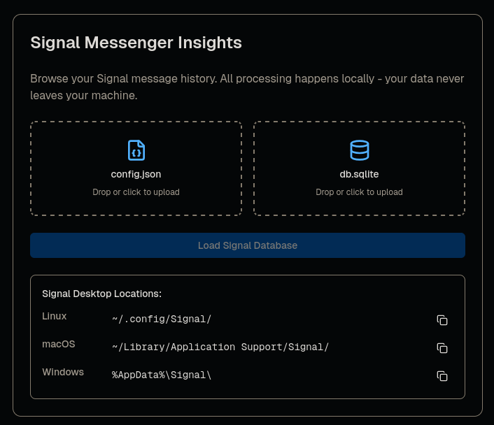
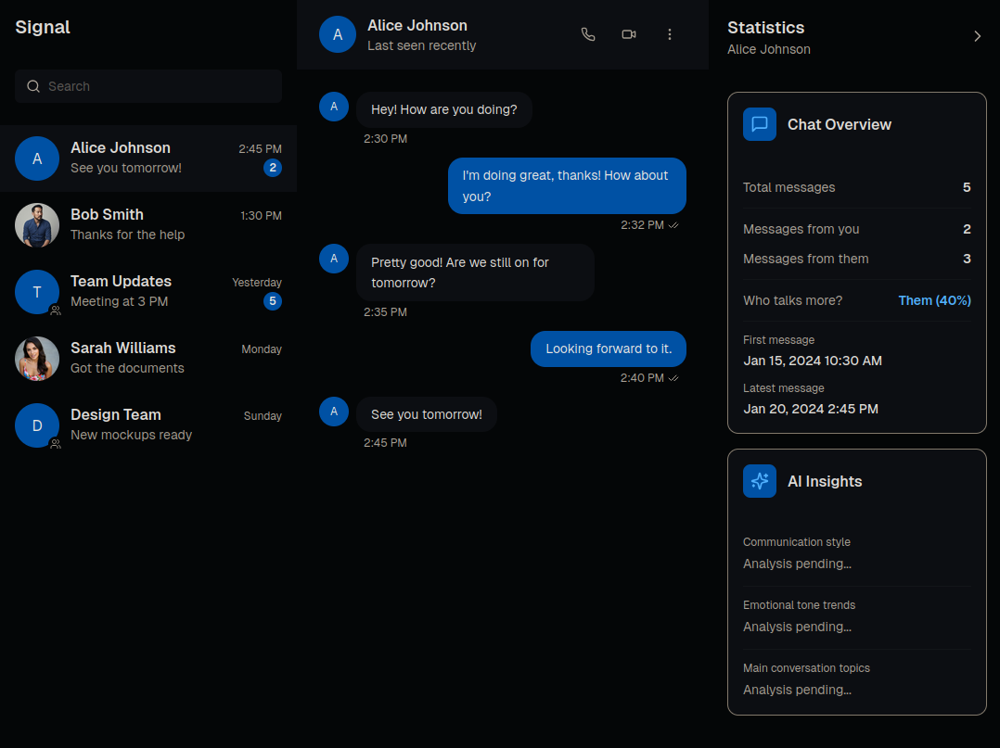
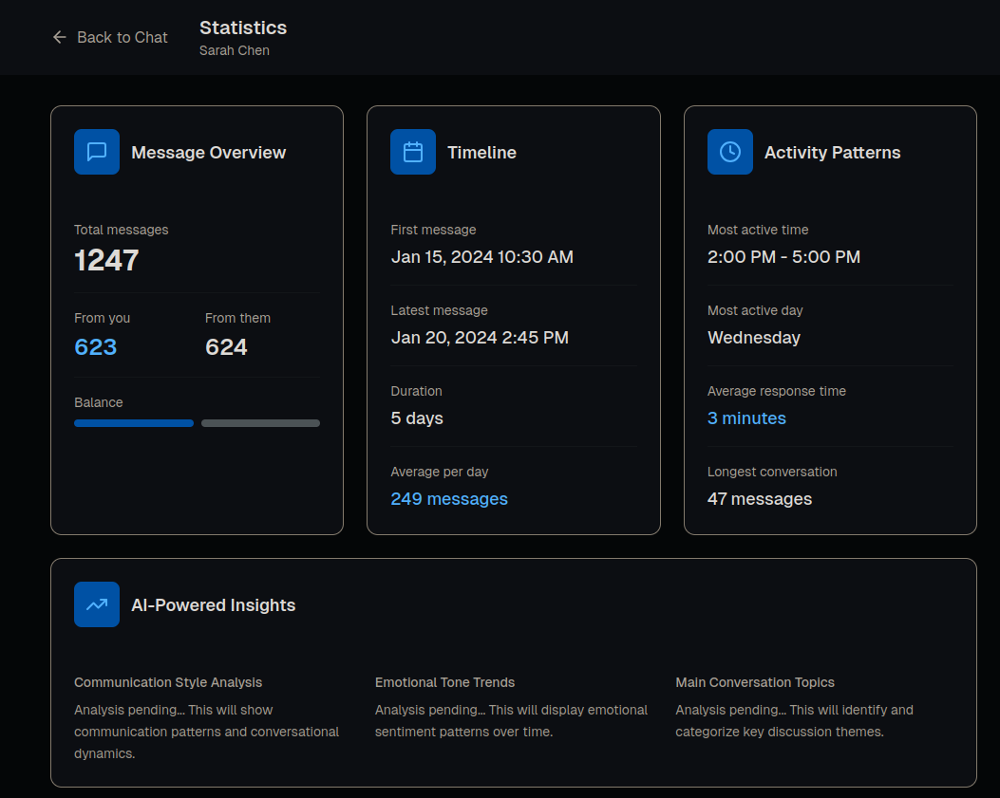

# Signal Messenger Insights


A secure, local-only tool for exploring your Signal Desktop message history. Decrypt, browse, search, and export conversations—without any data leaving your machine.

---

## Platform Support

| Platform | Status |
|----------|--------|
| Linux | Tested |
| macOS | Untested |
| Windows | Untested |

---

## Roadmap

- macOS testing and validation
- Windows testing and validation
- Updated conversation statistics

---

## Features

- **Local-only decryption** — all processing happens on your machine
- **Two data loading methods** — upload files via browser or mount Signal directory read-only
- **Conversation browser** — view messages with timestamps and pagination
- **Full-text search** — find messages by keyword
- **Attachment viewer** — view and export media files
- **Export options** — Markdown, HTML, JSON (coming soon)
- **LLM integration** — summaries, topic extraction (planned)

---

## Screenshots





---

## Quick Start (Upload Mode)

Start the containers:

```bash
docker compose up
```

Open `http://localhost:3000` and upload:

- `config.json`
- `db.sqlite` (from `sql/` directory in your Signal profile)

The app decrypts your database in-memory and displays your conversations. No data writes to disk unless you export intentionally.

---

## Finding Your Signal Files

### Linux

```
~/.config/Signal/
```

### macOS

```
~/Library/Application Support/Signal/
```

### Windows

```
%AppData%\Signal\
```

### Required Files

- `config.json` (see note below about encrypted keys)
- `sql/db.sqlite` (upload only this file; `db.sqlite-wal` and `db.sqlite-shm` are optional)

### Encrypted Keys

Signal Desktop stores database encryption keys two ways:

1. **Plain key** (older versions): `config.json` contains a `"key"` field with the actual key
2. **Encrypted key** (newer versions): `config.json` contains `"encryptedKey"` encrypted via system keyring

Docker cannot access your system keyring. If your `config.json` has an `encryptedKey` field, extract the plain key first:

```bash
# On your Signal Desktop system:
./extract-signal-key.sh
```

Create a new `config.json` with the extracted key:

```json
{
  "key": "your-extracted-key-here"
}
```

**Security note:** This key decrypts your entire Signal history. Keep it secure.

---

## Volume Mount Mode

Mount your Signal directory for automatic file detection:

Edit `docker-compose.yml` and uncomment the volumes section:

```yaml
volumes:
  - ~/.config/Signal:/signal:ro  # Linux
```

Then run:

```bash
docker compose up
```

The app auto-detects `/signal/config.json` and `/signal/sql/db.sqlite`.

---

## Usage

1. Launch the viewer (upload or volume mode)
2. Select your Signal data source
3. Browse conversations in the sidebar
4. Click any conversation to view messages, timestamps, and attachments
5. Search messages by keyword
6. Export conversations as needed

---

## Privacy

This project prioritizes your privacy:

- Runs entirely on localhost
- Requires no internet access
- Contains no telemetry or analytics
- Keeps decrypted data in-memory
- Mounts directories read-only

You control the container. You control your data.

---

## Development

### Local Development (without Docker)

**Frontend:**

```bash
cd frontend
npm install --legacy-peer-deps
npm run dev
```

Development runs on port 3001; production (Docker) runs on port 3000.

### Building with Docker

```bash
git clone https://github.com/0xsalt/signal-archive-viewer.git
cd signal-archive-viewer
docker compose build
docker compose up
```

---

## Disclaimer

This tool is designed for your own Signal Desktop data. Do not use it on systems or data you do not own or have explicit permission to analyze.

---

## Contributing

Bug reports, feature requests, and PRs welcome.

---

## License

MIT
